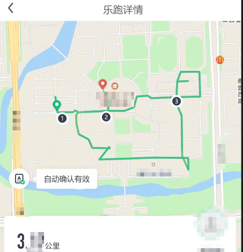

# Fuck-You-HappyRun

   

> 某山西大学乐跑逆向项目，实现了模拟轨迹/寻路算法过打卡点/陀螺仪数据，仅供参考学习
> 本项目（以下简称“本项目”）仅供学习、研究与技术交流之用，不构成任何形式的商业产品或服务。
> 非官方性质：本项目为个人/团队独立开展的逆向工程学习项目，与原始软件/硬件的权利人无任何关联，未获得其授权、认可或支持。
> 使用风险自负：任何人基于本项目进行的二次开发、修改、编译、分发或使用，均属其个人行为，由其自行承担全部后果。因使用或无法使用本项目及其衍生作品所导致的任何直接或间接损失（包括但不限于数据丢失、设备损坏、系统故障、法律纠纷等），本项目作者及贡献者概不负责。
> 禁止非法用途：严禁将本项目及其衍生作品用于任何违反法律法规、侵犯他人知识产权、破坏计算机信息系统、规避技术保护措施或其他不正当用途。因滥用本项目产生的一切法律责任，由使用者自行承担。
> 无担保声明：本项目按“现状”提供，不附带任何明示或默示的担保，包括但不限于适销性、特定用途适用性及非侵权性的担保。
> 二次开发责任：任何对本项目进行修改、衍生、再发布的行为，均不代表原作者立场。由此产生的衍生作品及其引发的任何后果，与原作者无关，原作者不承担任何连带责任。
> 保留权利：原作者保留随时修改、暂停或终止本项目的权利，且无需事先通知。
> 使用本项目即表示您已阅读、理解并同意上述全部条款。如不同意，请立即停止使用并删除相关内容。

## 目录结构

```
main/
├── auto-run.mjs               # 主入口：运行一次完整乐跑流程
├── config.json                # 配置文件（登录态 / 跑步参数）
├── lib/
│   ├── client.mjs             # HTTP 客户端：AES 加解密、签名、白名单校验
│   ├── signer.mjs             # 加密工具：AES-128-CBC、MD5 签名、POST body 组装
│   ├── track.mjs              # 轨迹生成：伪 GPS 点、步数、陀螺仪数据
│   ├── route.mjs              # 路径规划：环形跑道图、A* 寻路、路网规划
│   ├── record.mjs             # 记录组装：白名单过滤、log_data 构造、start_time 容差
│   ├── oss.mjs                # OSS 直传：STS 凭证获取、PostObject 上传、只读下载
│   └── config.mjs             # 参数管理：默认配置与 config.json 合并
└── README.md                  # 本文件
```

## 不提供精确的使用方法

- 具体运行流程：
- 1. 安装依赖，Nodejs，Python
- 2. 获取登录token
- 3. bash运行auto-rum.mjs

## 成功记录


## 核心流程

```
┌──────────────────────────────────────────────────────────────┐
│  0. 登录态校验 (UserInfo)                                     │
├──────────────────────────────────────────────────────────────┤
│  1. beforeRunV260 → game_id / run_zone_latlng 质心 / 规则      │
├──────────────────────────────────────────────────────────────┤
│  2. getTimestampV278 (第一次) → 服务端时间戳                    │
├──────────────────────────────────────────────────────────────┤
│  3. [正式跑] 从 run_line_info.point_list 按距离选择 3 个打卡点  │
│     算法复刻 setClocks：type 分类 + calcDis 分层 + shuffle       │
├──────────────────────────────────────────────────────────────┤
│  4. 真实等待 usedTimeS 秒（is_check_time 要求墙钟耗时达标）     │
├──────────────────────────────────────────────────────────────┤
│  5. getTimestampV278 (第二次) → 校准 end_time 时间窗口         │
├──────────────────────────────────────────────────────────────┤
│  6. 路网规划路径 + 本地构造 record（轨迹 / 步数 / 陀螺仪）     │
├──────────────────────────────────────────────────────────────┤
│  7. OSS 上传轨迹文件（distance>0.2km 时，AES 加密）            │
├──────────────────────────────────────────────────────────────┤
│  8. stopRunV278 / stopFreeRunV220 上传记录（16 字段白名单）    │
├──────────────────────────────────────────────────────────────┤
│  9. 补传陀螺仪数据（明文 JSON，gyroscope_file 含完整 OSS key）  │
└──────────────────────────────────────────────────────────────┘
```

Copyright (c) 2026 Suzuran